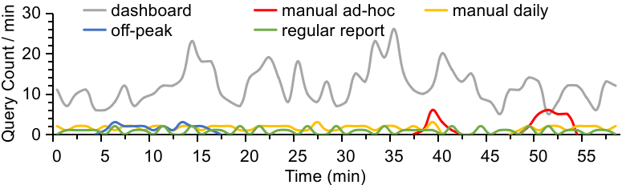

TODO: The glue conversion script requires optimization. It should only require two parameters: the input and output paths.

# TPC-H Data Experiment on AWS Athena
This project provides a complete framework for setting up and running TPC-H benchmarks against Amazon Athena.
It includes:

1. **Data Setup:** Scripts to generate, convert, and catalog TPC-H data at various scale factors using S3, AWS Glue, and EC2.
2. **Benchmark Tool:** A Java-based tool to replay query workloads against the cataloged data, simulating real-world concurrency and capturing detailed performance and cost metrics.

The database used in this experiment are designed to mimic a realistic BI workload, consisting of five databases of varying sizes and workload patterns:

| **DB**  | **Size (GB)** | **Workload Pattern** | **\#** | **SLAs**      |
|---------|---------------|----------------------|--------|---------------|
| $db_1$  | 10            | dashboard            | 720    | Rel/Imm=3/1   |
| $db_2$  | 30            | manual ad-hoc        | 34     | Imm           |
| $db_3$  | 30            | manual daily         | 87     | Imm/Rel=2/1   |
| $db_4$  | 100           | off-peak             | 22     | BoE           |
| $db_5$  | 100           | regular report       | 48     | Rel           |

The detailed query load is shown in the figure below:



## Part 1: TPC-H Data Setup Workflow

### 1. Generate TPC-H Raw Data
Ensure you have `git`, `make`, `gcc`, `pv`, and the `aws-cli` installed.

Run `scripts/generate_raw_data.sh` script, passing scale factor and your S3 staging bucket path as arguments. 
The script will generate data and place them in corresponding subfolders.

```bash
# Usage:
#   ./tpch_to_s3.sh <SCALE_FACTOR> <S3_PREFIX>
# Example:
#   ./tpch_to_s3.sh 10 s3://my-bucket/tpch/sf-10/
```

### 2. Convert Data to Parquet (AWS Glue Job)
Convert the raw pipe-delimited .tbl files into Parquet format, which is highly optimized for Athena

1. Navigate to the **AWS Glue** service in your console.
2. Go to **ETL jobs** and choose **Spark script editor**.
3. Create a new job by pasting the entire contents of `scripts/glue_conversion_job.py` into the script editor.
4. Configure the **Job details**:
    - **Name:** e.g., `tpch_conversion`
    - **IAM Role:** Select a role with S3 read/write and Glue permissions.
5. Configure the **Job parameters:**
    - **Type:** `Spark`
    - **Glue version:** `5.0`
    - **Worker type:** `G 2x`
    - **Number of workers**: `30`
6. This script is parameterized. You must run the job multiple times—once for each scale factor you want to process.
In the Job parameters section, provide the following arguments:
    * `scale_factor`: e.g., `10`
    * `source_path`： e.g., `s3://your-bucket-name/staging-tpch-raw/sf-10/`
    * `target_path`： e.g., `s3://your-bucket-name/athena-data/tpch_10/`
7. Run the job for each scale factor.

### 3. Create Glue Database & Crawler
Catalog the Parquet data, making it discoverable by Athena.

1. In the AWS Glue console, Navigate to **Crawlers** and click **Add crawler**.
2. Create a new crawler for each dataset you converted (e.g., one for `tpch_0`).
3. Crawler Configuration (Example for `tpch_0`):
    * **Crawler name:** `tpch_0_crawler`
    * **Data source:**
      * **S3 path:** Point to the output folder from Step 2 (e.g., s3://your-bucket-name/athena-data/tpch_0/)
      * **IAM role:** Choose a role with S3 read access and Glue catalog permissions.
      * **Target database:**
        * Click **Add database** to create a new one.
        * **Database name:** `tpch_db_0`
    * **Crawler schedule:** `Run on demand`
    * **Create a single schema for each S3 path:** `UnChecked` 
4. Run the crawler. When it completes, your `tpch_db_0` database will be populated with the 8 TPC-H tables.
5. Repeat this process to create crawlers and databases for your other datasets.

## Part 2: TPC-H Benchmark Tool
This is a lightweight, Java-based benchmark tool designed to test AWS Athena by replaying a trace file to simulate a real-world workload. 
It strictly adheres to the timestamp offsets defined in the file, submitting queries and recording detailed performance metrics (wait time, execution time) and estimated costs.

### Configuration
All benchmark settings are managed in `src/main/resources/config.properties`.

|                  Property                   |                                Description                                 |                                         Example                                          |
|:-------------------------------------------:|:--------------------------------------------------------------------------:|:----------------------------------------------------------------------------------------:|
|                `aws.region`                 |                    Your AWS region. Must be lowercase.                     |                                       `us-east-2`                                        |
|          `athena.output.s3.bucket`          |                 The S3 path to store Athena query results.                 |                           `s3://home-dongyang/athena-results/`                           |
|           `athena.dollars.per.tb`           |            The billing price (in USD) per TB scanned by Athena.            |                                          `5.0`                                           |
|              `query.file.path`              |                Local file path to the workload trace file.                 |                  `/home/gengdy/athena-experiment/workload/queries.txt`                   |
|             `results.file.path`             |              Local file path to store the benchmark results.               |                   `/home/gengdy/athena-experiment/workload/result.txt`                   |

### Input Format (Workload File)

The workload file specified by `query.file.path` must be a plain text file.
Each line represents a single query and must contain four columns, separated by a comma (,).

**Format：** `timestamp,database_name,query_id,query_string`
* `timestamp`: (Long) The query submission timestamp in milliseconds. This is a relative time from the start of the test.
* `database_name`: (String) The Athena database name to run the query against (e.g., tpch_db_0).
* `query_id`: (Integer) A unique identifier for the query (used for tracking and output).
* `query_string`: (String) The SQL query to execute. This is the fourth and final column; it may contain its own commas.

### Analyze Results
After running the benchmark, the results file specified by `results.file.path` will contain detailed metrics

You can run `scripts/analyze.py` to parse the results file and generate a summary report.
